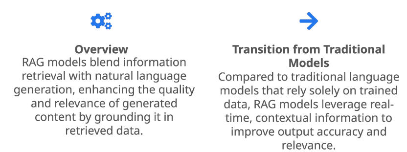

**Retrieval-Augmented Generation (RAG)** is an advanced AI technique that merges information retrieval with text generation, enhancing the capabilities of large language models (LLMs). RAG addresses limitations of pre-trained language models by enabling models to access and incorporate up-to-date or specific information from external sources that the model was not originally trained on into their responses. This technique is particularly useful for building  applications like Q&A chatbots and and content creation, which benefit from RAG's ability to enhance responses with external relevant, context-specific information.

## How does RAG work?
RAG enhances LLMs by integrating external data with text generation. To integrate specific data with LLMs, a retrieval module retrieves relevant data  based on the user's query from databases, APIs, or other sources. The retrieved data combines with the query are used to augment the prompt to generate a response. 
- Question: The user provides a query or question that needs answering.
- Retrieve: The model retrieves relevant documents or knowledge from an external database based on the question.
- Prompt: The retrieved information is incorporated into a prompt that is then fed to a large language model (LLM).
- LLM: The language model generates a response using both the retrieved knowledge and its own internal knowledge.
- Answer: The final output is a refined answer that leverages external data sources and LLM's generation capabilities.

  