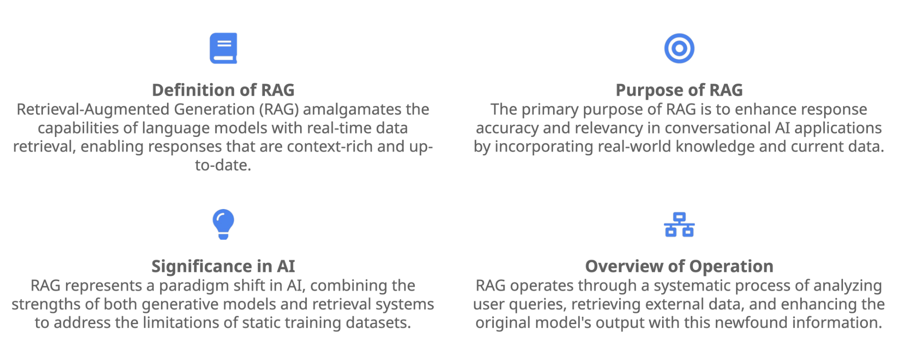

## What is RAG?
Retrieval-Augmented Generation (RAG) is an advanced AI technique that enhances large language models (LLMs) by incorporating external knowledge sources. This approach merges information retrieval with text generation, enhancing the capabilities of LLMs to provide more accurate, up-to-date, and context-aware responses across various applications.



RAG addresses limitations of pre-trained language models by enabling models to access and incorporate up-to-date or specific information from external sources that the model was not originally trained on into their responses. This technique is particularly useful for building  applications like Q&A chatbots and and content creation, which benefit from RAG's ability to enhance responses with external relevant, context-specific information. 


External information can take various forms and sources, such as product specifications, HR documentation, financial spreadsheets, databases or API. 

## Applications of RAG
Almost any business can transform its manuals, policies, videos, or logs into knowledge bases that enhance LLMs for various use cases like customer support, employee training, and developer productivity. RAG transforms how organizations handle information and provide services across various industries and business functions:
- *Healthcare*: LLMs with medical knowledge bases can support doctors and nurses in diagnosis, treatment planning, and patient care.
- *Finance*: Market data-driven RAG based assistants can help financial analysts with trend analysis, risk assessment, and investment strategies.
- *Customer Support*: RAG-enhanced chatbots can provide more accurate and up-to-date responses, improving customer satisfaction and resolution times.
- *Knowledge Management*: Employees can quickly access and utilize internal information, boosting productivity and decision-making quality.
- *Employee Onboarding*: Personalized, AI-driven onboarding systems can streamline the process and reduce the workload on human trainers.
- *IT Support*: RAG systems can provide fast, accurate IT solutions by leveraging existing knowledge bases and past ticket information.
- *Content Creation*: RAG systems can help content creators generating accurate, engaging content by pulling from various verified data sources.
- *Legal service*: RAG systems can help legal teams quickly retrieve and interpret relevant regulations and policies, ensuring compliance and reducing risk.   


## Why RAG?

**General-Purpose Training**: Most LLMs are trained on general domain data, which makes them less effective when handling highly domain-specific tasks. 

**Offline Nature of LLMs**: LLMs are generally offline models, meaning they are not aware of current events or any information that was not part of their training data.

Training or fine-tuning LLMs on domain-specific data doesn't always guarantee that the model will effectively acquire and utilize that specific knowledge in practice. In addition, fine-tuning is not always feasible, particularly for:
- Quantized Models: Fine-tuning becomes challenging in models that have undergone quantization to reduce memory usage and computational overhead.
- Large Models: Fine-tuning large-scale models can be difficult due to their immense memory and computational resource requirements, especially if they are not specially designed for a particular domain.

## How does RAG work?

Here's the key components in the Retrieval-Augmented Generation (RAG) process.   

1. **Query**: The query can originate from either a user or another LLM. This query represents the user's prompt or a request for information.
2. **Embedding Model**: The query is passed to an embedding model, which converts the query into a vector embedding. Embeddings are numerical representations that capture the semantic meaning of the query, allowing it to be compared with other similar content.
3. **Vector Database**: The vector embedding of the query is used to retrieve relevant documents or knowledge from a vector database based on the similarity of embeddings. This database contains precomputed embeddings of various chunks of information (documents, text passages, etc.). The retriever performs a similarity search on the vector database to find similar chunks in the vector database that closely match the query’s embedding.  
4. **Contextualized Prompt**: The retrieved results (similar chunks) are combined with the original query to create a contextualized prompt — essentially the user's query enhanced with relevant information retrieved from the database.
5. **LLM**: The augmented prompt is then passed to the LLM to generate a more accurate and informed response.

<p align="center">
    
</p>

At a high level, RAG operates through two key processes: : (1) Data Ingestion and Vector Database Construction and (2) Retrieval and Generation.

1. Data Ingestion and Vector Database Construction: Load data from various sources, split into manageable chunks, and indexed for efficient retrieval. This process is akin to data cleaning and feature engineering in machine learning, or ETL (Extract, Transform, Load) pipelines in traditional data management, and generally involves 
   - Load the Data: This stage involves importing the data from its source, such as databases, files, or APIs, into the system where it can be processed. There are numerous libraries exist for the purpose of importing data from different sources. For example, LangChain is one such library, providing a versatile set of document loaders.

        ```
        from langchain_community.document_loaders.csv_loader import CSVLoader
        from langchain_community.document_loaders import UnstructuredPDFLoader
    
        csv_file_path="./example_data/mlb_teams_2012.csv"
        loader = CSVLoader(csv_file_path)
        data = loader.load()
        
        pdf_file_path = "./example_data/layout-parser-paper.pdf"
        loader = UnstructuredPDFLoader(pdf_file_path)
        docs = loader.load()
        ```
    - Extract Data with Parser: Raw data often contains inaccuracies, typos, or inconsistencies that can hinder parsing and processing. Particularly PDFs, these formats can present challenges due to their layout, formatting, and embedded elements. Semi-structured data can encompass text, tables, images, and graphs, requiring diverse extraction methods. Specialized tools like LlamaParse provide solution for extracting data from challenging document formats.
        ```
        from llama_parse import LlamaParse
        
        parsing_instructions = "You are parsing a receipt from a restaurant. Please extract the total amount paid and the tip."
        
        documents = LlamaParse(result_type="markdown", parsing_instructions=parsing_instructions).load_data('./receipt.pdf'
        ```
     
    - Chunk long document: Large documents can lead to information loss when embedded. Chunking helps maintain semantic coherence within each chunk, leading to better embeddings. Also, if semantically related text fall into the same chunk, it avoids possible loss of information due to part of the context is in a different chunk that is not retrieved. The several common chunking strategies are:
        - Semantic chunking: Divide text into meaningful units based on the semantic similarity between different parts of the text. It focuses on the underlying meaning and context of the text, and keeps related pieces of text together.
          ```
          chunkingStrategyConfiguration = {
            "semanticChunkingConfiguration": {          
             'breakpointPercentileThreshold': 95,
             'bufferSize': 1,
             'maxTokens': 300 }
          }
          ```
        - Fixed-Size Chunking: Divide the document into chunks of a predetermined size.
        - Hierarchical chunking: It organizes documents into parent chunks and child chunks, where related content is grouped together under a common parent. By preserving the hierarchical structure and relationships between different parts of the document, it can improve the accuracy and efficiency of interpreting documents like legal documents and technical manuals.
          ```
          chunkingStrategyConfiguration = {
            "chunkingStrategy": "HIERARCHICAL",      
            "hierarchicalChunkingConfiguration": {                                                                                
               'levelConfigurations': [
	                {'maxTokens': 1500},
	                {'maxTokens': 300}
	               ],
             'overlapTokens': 60   
             }
          }
          ```
        - Create embeddings (vector representations) of chunks.
        
    - Index and Store the Data: Finally, the transformed data is indexed and stored in a way that allows for efficient retrieval. This involves creating a vector index, which is a data structure optimized for efficiently storing and retrieving high-dimensional vector data, allowing for fast similarity searches and nearest neighbor queries.
    
2. Retrieval and Generation: During inference, a user query was entered and it was processed by encoding model. Then a retrieval module retrieves relevant data based on the user's query from databases, APIs, or other sources. The retrieved data combines with the query are used to augment the prompt to generate a response.
 
 